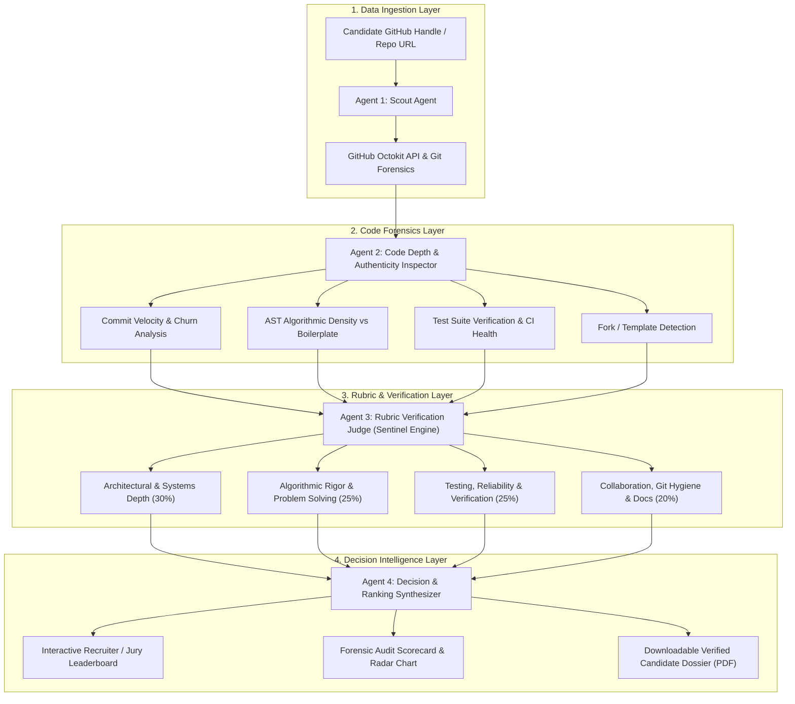

# 🛡️ Anvaya Sentinel — System Architecture

> **Tagline:** Autonomous Multi-Agent Decision Intelligence for Developer Profiling & Hackathon Jury Scoring.  
> **Theme:** Theme 1: Agentic AI & Intelligent Systems (Primary) / Theme 7: Decision Intelligence (Secondary)  
> **Team:** Kilani Sai Nikhil (`[ARCHITECT]`) & Harika Reddy (`[SENTINEL]`)

---

## 1. Executive Summary

Technical hiring and hackathon judging suffer from high-friction, subjective, and easily gamed evaluation processes. Resumes and submitted links are flooded with buzzwords, cloned tutorial code, and unverified passenger contributions. 

**Anvaya Sentinel** is an autonomous multi-agent evaluation pipeline that accepts a developer's GitHub profile or project URL, runs forensic git inspection (commit cadence, diff complexity, test coverage, authentic code vs forks), evaluates the candidate against a multi-dimensional rubric via an LLM-as-a-Judge consensus loop, and generates an explainable, audit-trailed scorecard and ranked leaderboard.

---

## 2. Multi-Agent Pipeline Architecture (The 4-Agent DAG)

---

## 3. Subsystem Breakdown & Work Split

### 🤖 Subsystem 1: Lead Systems, Forensics & Agentic Orchestration (Nikhil / `[ARCHITECT]`)
1. **GitHub Ingestion Engine (`/backend/services/github_scraper.js`):**
   * Fetch user repos, commits, PR reviews, branches, language distributions, and commit timestamps.
   * Rate-limit management & Octokit caching.
2. **Code Forensics & Authenticity Inspector (`/backend/agents/forensics_agent.js`):**
   * Computes **Authentic Engineering Index (AEI)**: identifies genuine custom code vs popular library starter templates.
   * Analyzes commit history to flag bulk "one-shot" uploads vs iterative, verified engineering.
   * Validates presence of unit tests, CI workflows, and documentation.
3. **Agent Orchestration & State Machine (`/backend/agents/orchestrator.js`):**
   * Manages the execution DAG across the 4 agents using Gemini 2.5 Flash / Pro.
   * Strict schema validation via Zod to enforce deterministic JSON payloads.
4. **Backend REST API & Database (`/backend/server.js`):**
   * Express.js API endpoints for candidate evaluation, leaderboard retrieval, and status streaming.
   * Persistence using SQLite / PostgreSQL.

---

### 🛡️ Subsystem 2: Rubric Systems, Verification Integrity & Dashboard UX (Harika / `[SENTINEL]`)
1. **Rubric Engine & Multi-Criteria Scoring Matrix (`/backend/rubrics/evaluation_rubric.js`):**
   * Defines structured criteria across 4 dimensions: *Systems Depth, Problem Complexity, Verification & Testing, Git Hygiene & Collaboration*.
   * Anti-hallucination verification gates ensuring all AI scores are backed by direct commit or code citations.
2. **Decision Intelligence & Audit Dossier Generator (`/backend/agents/ranking_synthesizer.js`):**
   * Aggregates multi-agent scores into an overall percentile and recommendation verdict (`STRONG ADVANCE`, `INTERVIEW`, `PASS`).
   * Generates actionable feedback and jury defense questions for interviewers.
3. **Interactive Recruiter & Jury Dashboard (`/frontend/src/`):**
   * High-polish React + Vite + Tailwind CSS interface.
   * Real-time candidate evaluation input with animated agent pipeline progress.
   * Candidate comparison leaderboard with dynamic sorting, search, and filtering.
   * Radar chart visualization (Recharts) mapping candidate dimensional strengths.
   * Detailed audit drawer/modal with evidence citations.
4. **PDF Dossier Export & Stage Defense Documentation (`/docs/`):**
   * Exportable technical summary for hiring committees and hackathon juries.
   * Rubric compliance defense playbook.

---

## 4. Tech Stack & Invariants

* **Frontend:** React.js, Vite, Tailwind CSS, Lucide React, Recharts (Radar / Bar charts)
* **Backend:** Node.js, Express.js, Octokit (@octokit/rest), Zod
* **AI Engine:** Google Gemini 2.5 Flash (Structured Object Generation)
* **Database:** SQLite (local dev) / Supabase PostgreSQL (production)
* **Deployment:** Vercel (Frontend) + Render / Railway (Backend)
