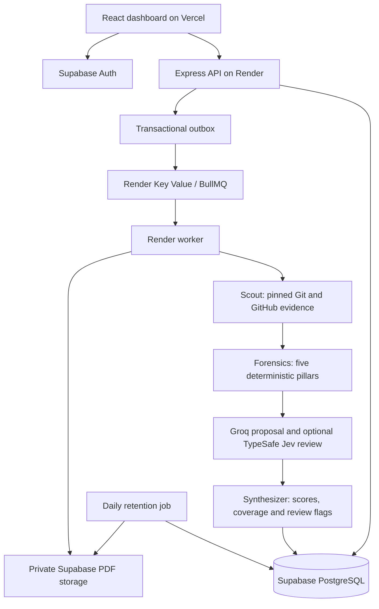

# SIFT architecture

The SIFT Core Team. This document describes the implemented system.

## Durable execution

Audit creation writes the candidate/audit, idempotency entry, and outbox entry in one transaction. The dispatcher sends jobs with fixed IDs and marks outbox entries only after queue insertion. Workers acquire a PostgreSQL session advisory lock per audit and persist stage attempts and checkpoints. Completed stages are skipped after a restart. Each repository snapshot is saved incrementally at its pinned revision.

BullMQ retries jobs three times with provider-aware backoff. Cancellation is persisted and checked between operations. Evaluation failures after forensics retain a partial assessment. Explicit retry keeps captured snapshots and reruns evaluation; expired raw evidence requires a new audit. A new audit can attach to an existing candidate in the same cohort. Reports and reviewer decisions retain the originating audit ID.

The pipeline is currently a linear graph, implemented as a persisted state machine. LangGraph can be introduced when branching, multiple judge reconciliation, or graph-specific resumable interactions become necessary. It is not a current dependency.

## Acquisition and forensics

Public GitHub repositories are normalized to owner/name. Octokit collects cached GitHub metadata, events, PR/review data, and check runs with bounded pagination. Git fetches bare object data without checkout, hooks, submodules, or dependency execution. File count, byte, history, parser, and time limits are enforced. Generated/vendor/binary/symlink content is excluded or disclosed. Evidence records have stable IDs, content hashes, capture dates, snapshot SHAs, and source URLs.

Timeline checks distinguish author and committer dates and limited push-event observations. Concentrated initial churn triggers review, not proof of a zip import. Contributions are descriptive and cannot establish identity or productivity. Isolated AST parsing identifies empty and placeholder bodies in supported languages. Similarity compares exact blobs against declared upstream and an organization-approved, revision-pinned template corpus; it is not an exhaustive plagiarism search.

## Rubric and decision-provider contract

| Dimension | Weight |
| --- | --- |
| Systems rigor | 30% |
| Algorithmic depth | 25% |
| Testing and verification | 25% |
| Collaboration hygiene | 20% |

Each dimension has anchored levels 0–4 or null for insufficient evidence. Groq serves `openai/gpt-oss-120b` with strict JSON output. The model receives untrusted repository text as data, has no execution tools, and must return structured output. Citation line bounds are required on the wire and nullable for non-code sources, then normalized for application validation. The validator checks evidence IDs, verbatim excerpts, line bounds, and appropriate source kinds. One corrective response is allowed before withholding the judgment. Citation correspondence is verified mechanically; semantic support still requires reviewer judgment. The default `DECISION_PROVIDER=none` uses Groq only. The opt-in TypeSafe Jev layer asks separate Noul questions about evidence support and rubric anchors, retains probabilities and the actual model, and withholds unsupported levels. The worker checkpoints the Groq proposal before verification so Jev retries can reuse it. Jev is TypeSafe's model, not the name of SIFT's rubric. See [DECISION_PROVIDERS.md](DECISION_PROVIDERS.md).

The weighted overall score is available only when all dimensions are scored and acquisition coverage is complete. Forensic risk is separate from technical quality and role fit. Rankings require an explicit rollout flag and compare the latest eligible audit only within one cohort and matching rubric, prompt, provider, and model versions. Reviewers make the final workflow-specific decision and record a rationale.

## Tenant boundaries and lifecycle

Supabase validates bearer sessions. Every API read/write enforces organization membership; viewer roles cannot mutate. SQL RLS gives authenticated users tenant reads and no direct writes. Background operations use a trusted database connection. Outbox, cache, cleanup records, and private storage have no browser policies. Production uses certificate-verified database TLS and short-lived signed PDF URLs.

Raw evidence expires after 30 days. Citation excerpts, source manifests, audit assessments, decisions, and reports are retained for up to a year, with older audits retained while referenced by newer decisions/reports. Daily retention removes raw content, expired reports and caches, and eligible old records. Organization deletion cascades tenant records immediately and queues storage cleanup; cleanup tombstones repeat for seven days to catch in-flight uploads. Shared public GitHub cache entries expire independently.

## Ownership and limits

Harika reviews `backend/src/jev/` and its rubric/citation tests. Nikhil reviews ingestion, forensics, API, persistence, workers, and deployment. Shared contract changes require both owners. See [OWNERSHIP.md](OWNERSHIP.md).

The UI is connected to real API data. Live model evaluation, provider auth/storage, restore drills, and human rubric calibration must be exercised in staging with provider credentials before launch; see [DEPLOYMENT.md](DEPLOYMENT.md).
