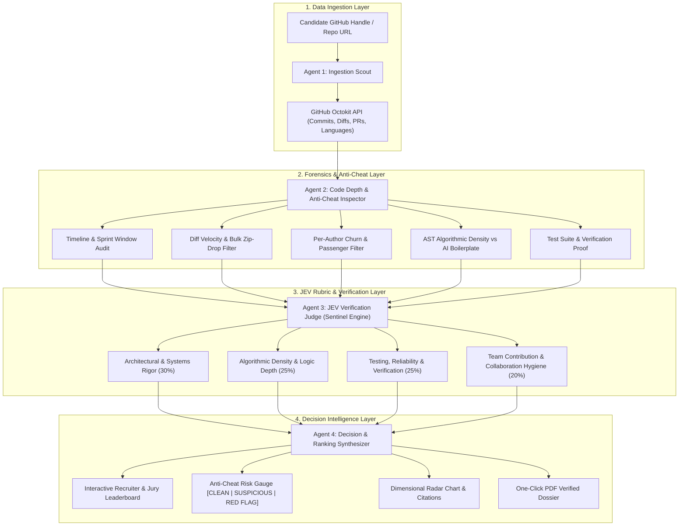

# 🔍 SIFT — System Architecture

> **Tagline:** Autonomous Code Forensics, Anti-Cheat Verification & JEV Decision Intelligence for Developers & Hackathon Juries.  
> **Theme:** Theme 1: Agentic AI & Intelligent Systems (Primary) / Theme 7: Decision Intelligence (Secondary)  
> **Team:** Kilani Sai Nikhil (`[ARCHITECT]`) & Harika Reddy (`[SENTINEL]`)

---

## 1. Executive Summary

Technical hiring and hackathon judging suffer from an epidemic of resume fluff, copy-pasted tutorial code, AI-generated boilerplate, and passenger contributions. Traditional ATS keyword matchers and exhausted human juries cannot detect whether a candidate actually wrote the code or downloaded a starter zip at 2 AM.

**SIFT** is an autonomous multi-agent decision intelligence system. With simply a **GitHub profile** or **repository link**, SIFT executes deep Git forensics, runs a 5-pillar Anti-Cheat inspection, evaluates technical claims against a structured rubric via the **JEV (Judgement, Evaluation & Verification)** engine, and synthesizes an unforgeable candidate scorecard with live leaderboards.

---

## 2. Multi-Agent Pipeline Architecture (The 4-Agent DAG)

---

## 3. The 5-Pillar Anti-Cheat Forensics Suite

1. **Timeline & Sprint Anomaly Filter:** Cross-checks `AuthorDate`, `CommitDate`, and GitHub push events against event/sprint windows. Detects pre-built projects imported under a fresh repo.
2. **Bulk Zip-Drop & Starter Filter:** Analyzes commit velocity. If 90%+ of code is dumped in 1–2 initial commits with standard framework fingerprints (`create-react-app`, `starter-kit`), it flags boilerplate and recalculates true engineering volume.
3. **Passenger / Ghost Contributor Filter:** Inspects Git blame and commit diffs per author. Flags team members claiming equal credit who only committed README/comment/formatting edits.
4. **Hollow Implementation / AI-Slop Detector:** Flags functions with mock hardcoded JSONs, empty `pass` / `TODO` blocks, and low cyclomatic complexity disguised as large line counts.
5. **License Stripping & Plagiarism Scanner:** Detects stripped open-source headers, unmodified public functions, and uncredited forks.

---

## 4. Work Split & Ownership Matrix

### 🤖 Subsystem 1: Lead Systems, Forensics & Agentic Orchestration (Nikhil / `[ARCHITECT]`)
* GitHub API ingestion & rate-limited cache.
* 5-Pillar Anti-Cheat Forensics Engine implementation.
* AST code depth parser & Git blame churn analysis.
* 4-Agent DAG state machine & tool execution using Gemini 2.5.
* Express.js backend API endpoints & persistence.

### 🛡️ Subsystem 2: JEV Rubric Engine, Audit Dossier & Dashboard UX (Harika / `[SENTINEL]`)
* JEV Multi-Dimensional Rubric Engine & Scoring Matrix.
* Anti-hallucination verification gates (mandatory commit/file citation for every score).
* Interactive Recruiter / Jury Dashboard (React + Vite + Tailwind CSS, candidate cards, radar chart, anti-cheat status banner).
* One-click PDF candidate audit dossier export.
* Hackathon jury presentation & rubric defense playbook.

---

## 5. Technology Stack

* **Frontend:** React 18, Vite, Tailwind CSS, Lucide React, Recharts
* **Backend:** Node.js, Express.js, Octokit (@octokit/rest), Zod
* **AI Engine:** Google Gemini 2.5 Flash / Pro (Structured Output API)
* **Database:** SQLite (local dev) / Supabase PostgreSQL (production)
* **Deployment:** Vercel (Frontend) + Render / Railway (Backend)
