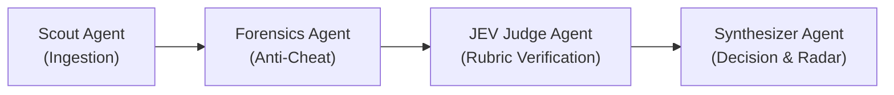

# 🔍 SIFT

> **Autonomous Code Forensics, Anti-Cheat Verification & JEV Decision Intelligence for Developers & Hackathon Juries**

---

## 🌟 Overview

Technical hiring and hackathon judging face a growing crisis of trust:
* Resumes are flooded with AI-generated buzzwords.
* Hackathon teams download pre-existing templates, dump them in a single commit, and bluff with shiny presentations.
* In team projects, passengers who wrote zero lines of code claim equal credit alongside the core builder.

**SIFT** replaces resume claims with **unforgeable proof of work**. Powered by an autonomous 4-agent DAG, SIFT ingests public GitHub profiles or project repositories, conducts forensic git analysis and anti-cheat checks, evaluates technical depth against a multi-dimensional rubric via the **JEV (Judgement, Evaluation & Verification)** engine, and generates an explainable, audit-backed candidate dossier.

---

## 🛡️ The 5-Pillar Anti-Cheat Suite

1. **Timeline & Sprint Window Audit:** Detects pre-built projects imported as fresh hackathon submissions.
2. **Bulk Zip-Drop & Starter Filter:** Flags single-commit code dumps and isolates bespoke business logic from framework boilerplate.
3. **Passenger / Ghost Contributor Filter:** Inspects Git blame and commit diffs per author to expose free-riders.
4. **Hollow Implementation / AI-Slop Detector:** Uncovers mock hardcoded returns, dead code stubs, and low cyclomatic complexity.
5. **License Stripping & Plagiarism Scanner:** Flags stripped open-source headers and uncredited upstream copies.

---

## 🤖 The 4-Agent Autonomous Council

1. **Agent 1: Ingestion Scout** — Fetches full commit history, diffs, PR reviews, branches, and language distributions via GitHub API.
2. **Agent 2: Forensics & Anti-Cheat Inspector** — Analyzes commit velocity, AST complexity, test coverage, and executes the 5 Anti-Cheat checks.
3. **Agent 3: JEV Verification Judge** — Evaluates code against a strict 4-pillar rubric using Google Gemini 2.5 with mandatory commit/file citations (zero hallucinations).
4. **Agent 4: Decision & Ranking Synthesizer** — Aggregates scores, assigns an Authenticity Verdict (`CLEAN`, `SUSPICIOUS`, `RED FLAG`), generates a 4-axis radar profile, and ranks candidates on an interactive leaderboard.

---

## 💻 Tech Stack

* **Frontend:** React 18, Vite, Tailwind CSS, Lucide Icons, Recharts
* **Backend:** Node.js, Express.js, Octokit, Zod
* **AI Engine:** Google Gemini 2.5 Flash / Pro (Structured Object Output)
* **Database:** SQLite / PostgreSQL (Supabase)
* **Deployment:** Vercel (Frontend) + Render / Railway (Backend)

---

## 👥 Core Engineering Team
* **Kilani Sai Nikhil** (`[ARCHITECT]`): Lead Systems, Forensics, Anti-Cheat Rules & Agentic Orchestration Architect
* **Harika Reddy** (`[SENTINEL]`): Lead Rubric Systems, JEV Verification Integrity, Audit Dossier & UX Lead

---

## 📄 License
MIT License. Built with first-principles engineering by the SIFT Core Team.
